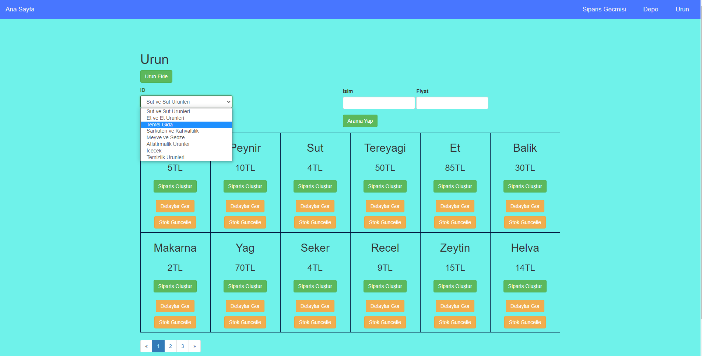
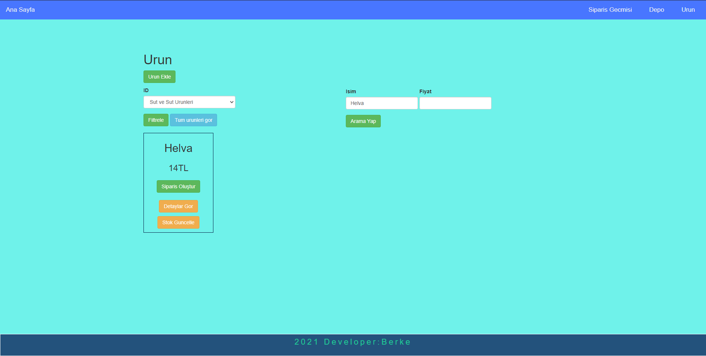
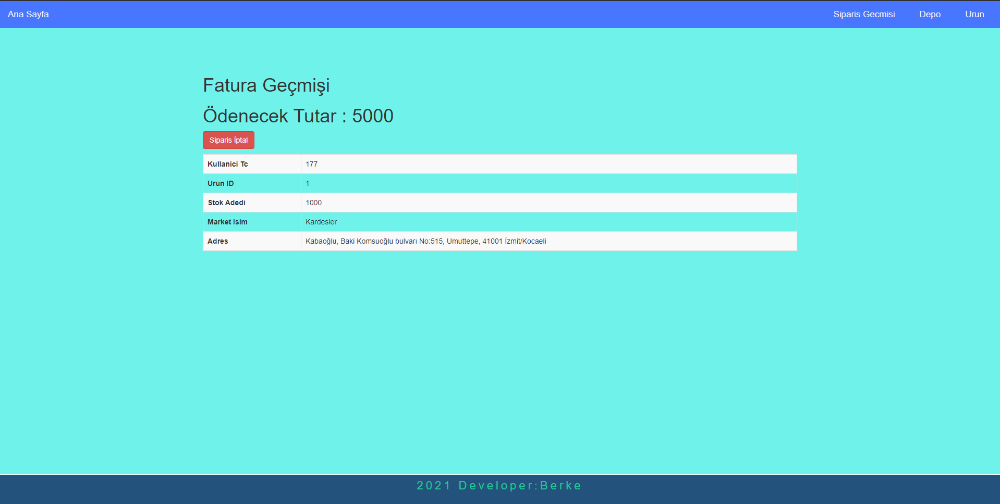
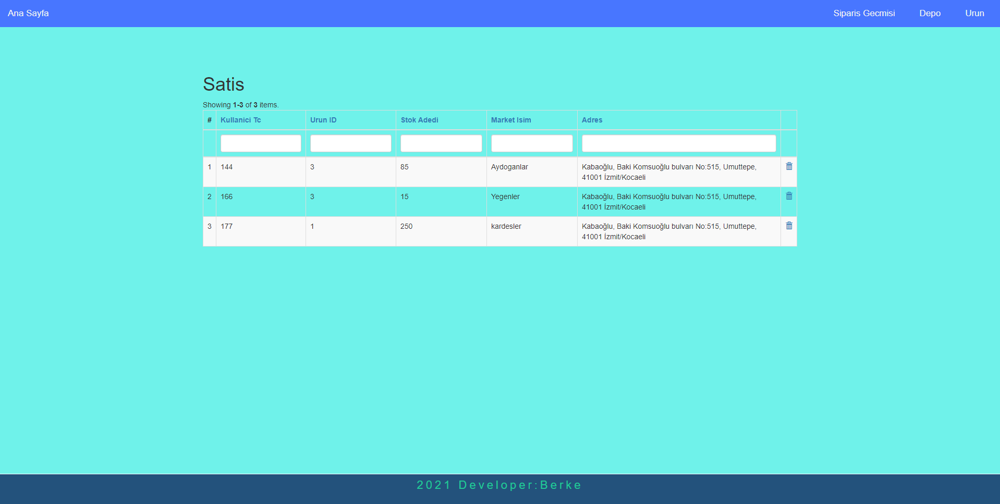
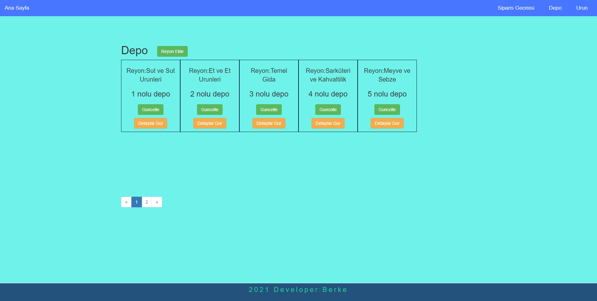
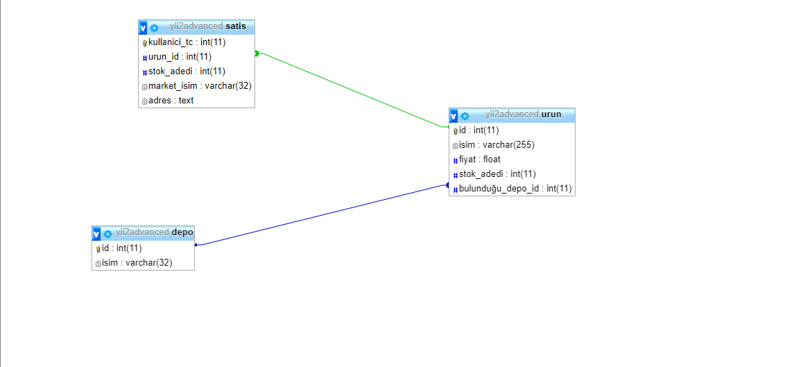

# yii2-project

#Sefa Berke Kara / 180202086

#Projenin Amacı

Bu modül toptancı da bulunan ürünleri ve bu ürünler ile sipariş oluşturulmak için tasarlanmıştır.  
Modüle sadece admin kullanıcısı erişebilir.Yani müşteriler bu ekrana erişemez.
Toptancıdaki sayfayı kullanacak olan admin ürünleri eklemeden önce o ürünlerin hangi depoda hangi kategoriye ait olacağını ekleyerek depo veritabanına kaydeder.
Ardından depoya kaydedilmiş olan kategoriden sonra eğer depoya ürün gelecekse "Urun ekle" butonundan ürünün özelliklerini girerek hangi depoya ait olduğunu seçerek de urun veritabanına kaydeder.
Kaydedilen Urunlerin görülmesi için "nav-bar" çubuğundan "Urun" sekmesine basarak kaydedilen ürünleri orada görür.Bu ürünler admine "card-view" olarak gösterilir ve her 12 üründe bir diğer sayfaya geçiş yapılarak diğer sayfaya eklenir.
Ürün sayısı çok olduğu zamanlarda ürünleri bulmakta zorluk yaşanmaması için eğer admin ürünün hangi kategoriye ait olduğunu biliyorsa kategori ile arama "drop-Listi" koyularak diğer ürünlerin içerisinden ürünün daha çabuk bulunması sağlanmıştır.
Eğer admin ürünü adıyla bulmak isterse erişimi kolaylaştırıcak bir "field" alanı koyulmuştur aynı üründen birden fazla depoya kaydedilmiş ise bu 2 üründen fiyatına göre de arama yaptırılması için "field" alanı koyulmuştur.
Eğer bu toptancıya bir müşteri gelir ve toptan olarak bir ürün almak isterse fatura bilgilerini oluşturulması için ürünün altındaki "sipariş oluştur" butonuna tıklanarak müşteriye ait bilgiler bu form da doldurulur.Form da sipariş edilen her ürün için orada güncel stok bilgisi bastırılmıştır eğer admin bilgilendirilmek için basılan stok adedinden fazla bir ürün giriş yaparsa sistemde aksaklık olması ürün alma işlemi oluşturulmaz.Ekranda yazan kadar yada ondan daha az adet girerse o zaman fatura bilgisi oluşturulur.Bu fatura bilgisinde hesaplamalar yapılarak müşterinin de ne kadar ücret ödeceği ekrana basılır.
Müşteri depodan ne kadar ürün almak istediyse mevcut stoktan düşülerek yeni stok veritabanına kaydedilir.

## Modülün kullanımı
### Kurulum

[https://github.com/yiisoft/yii2-app-advanced](https://github.com/yiisoft/yii2-app-advanced) adresindeki anlatımlar şeklinde sanal makina kurulur.
advanced/vendor/berkekaraa/yii2-project adresine githubtan indirilen dosyalar eklenir. Ve ardından \backend\config\main.php dosyalarına aşağıdaki kod parçacığı eklenir.
```php
'modules' => [
        'project' =>
        [
            'class' => 'berkekaraa\project\Module'
            
        ],
```

Son olarak yapılack işlem modül'ün bulunduğu github deposu composer.json'da tanıtıldıktan sonra modül kullanıma hazırlanmış olur.

### Packagist
Bu modül [https://packagist.org/packages/berkekaraa/yii2-project](https://packagist.org/packages/berkekaraa/yii2-project) adresinde paket olarak önceden tanımlandı.Sanal makinanın içerisine "vagrant ssh" komutu ile sanal makinaya bağlanılır.Oradan cd /var/www/advanced klasörüne gidilerek aşağıdaki
```php
composer require berkekaraa/yii2-project "dev-main"
```
kod parçacığı ile projeye dahil edilir.

Modül indirildikten sonra eğer kurulum [https://github.com/yiisoft/yii2-app-advanced](https://github.com/yiisoft/yii2-app-advanced)  adresinden yapılmadıysa gerekli paketlerin yüklenmesi için aşağıdaki kod çalıştırılmalıdır.
```
vagrant ssh
cd /var/www/advanced
composer update

```

#Migration ile tabloların oluşturulması ve kayıt eklenmesi
Modülün kullanılabilmesi için gerekli tabloların oluşturulması ve örnek kayıtların girilmesi için aşağıdaki kodlar çalıştırılmalıdır.Migration kodlarının çalıştırılmasıyla tablolar, kurallar ve ilişkiler oluşturuluyor.

```
vagrant ssh
php yii migrate/up depo --migrationPath=@vendor/berkekaraa/yii2-project/src/migrate
php yii migrate/up urun --migrationPath=@vendor/berkekaraa/yii2-project/src/migrate
php yii migrate/up satis --migrationPath=@vendor/berkekaraa/yii2-project/src/migrate
```

### Backend

Proje Backend için tasarlanmıştır.Bu kısımda kullanıcıya ilk olarak örnek olarak oluşturulan ürünler gösterilir."Nav-bar" çubuğunda "depo","Urun","Siparis Gecmisi" ve "Ana Sayfadan oluşmaktadır".
"Ana Sayfa" 'ya basıldığı takdir de ana ekran olarak urunler sekmesi gösterilir.
"Siparis Gecmisi" 'ne basıldığı takdir de eğer admin kendi toptancısından satış yapmış ise kime satış yaptığına dair geçmişi buradan görebilir.
"Depo" 'ya basıldığı takdir de urunlerin ait olduğu depolar listelenir.
"Urun" sekmesine basıldığında yine eklenen tüm ürünler adminin karşısında gösterilir.

Gerekli yerlede gerekli arama işlemleri koyularak ürünlere daha çabuk erişim sağlanması amaçlanmiş ve gerçekleştirilmiştir.

Urunler listesindeki butonlar:
"Siparis olustur " : Bu butona tıklandığında adminin önüne form gösterilerek müşteri bilgileri girişi sağlanır ve fatura bilgisi oluşturulur.
"Detayları Gor" : Bu butona tıklandığında ürün hakkındaki bilgiler admine gösterilerek ürün hakkında bilgi edinmesi sağlanır.
"Stok güncelle" : Bu butona tıklandığında eğer toptancıda ürün kalmadıysa ve depoya ürün girişi yapılacaksa stok adedi güncellenir.

Backend'e
```
http://advanced/backend/web/index.php?r=project/urun
```

adresinden erişilebilir.
####Widget
Widget kullanımına örnek olarak gii'nin oluşturduğu gridview özelleştirilerek kullanıldı.Ayriyetten "nav-bar" ve "footer" html kodları "deneme widget" ve "footer widget" geliştirilerek projeye implement edildi.Modül içerisinde html kodları ile harmanlanmış "card view" eklenerek de görsel daha da güzelleştirildi.

##Migrate Komutu çalışınca oluşan tablolar
Advanced içinde gömülü gelen phpmyadmin veritabanına ilk olarak depo adında bir tablo oluşturulur.Bu tablo da bir tane primary key bulunmaktadır.Bu da aynı urun kategorisinden birden fazla eklenmesini engellemek için yapılmıştır.
Depo veritabanın ardından Urun tablosu oluşturulur.Bu tabloda "id" adında bir primary key oluşturulmuştur ve urun tablosundaki "id" ile depo tablosundaki "id" ile ilişkilendirilme yapılmıştır.
Son olarak da satis tablosu oluşturulur.Bu tabloda "kullanici_tc" adinda bir adet primary key oluşturulmuştur.Satis tablosundaki "urun_id" ile urun tablosundaki "id" eşleştirilerek urunlerde ekli olmayan bir urunu almaya çalışılması engellenmiştir.

####Projenin genel görünümü

###Urunleri isme göre filtreleme sonucu

###Siparis oluşturulduktan sonraki sonuç

###Urun satın alan kisilerin bilgiler

###Depodaki kategoriler listesi

###veritabanı anahtar ilişkisi


